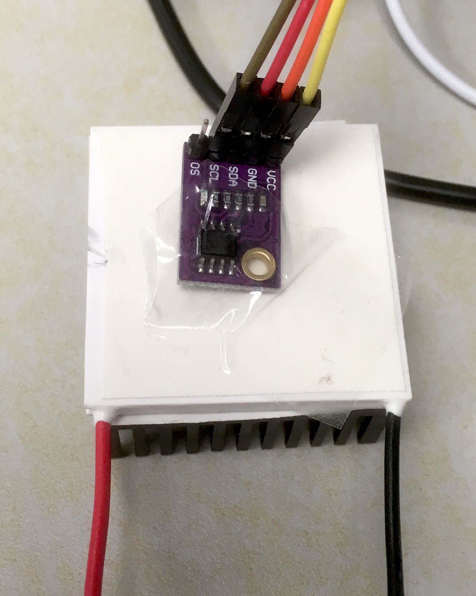

# PWM, H-Bridges & Temperature Control

## Overview
Pulse-Width Modulation, motor/element driving via H-Bridges, and feedback loop logic.

## Pulse-Width-Modulation and LED brightness


### What is Pulse-Width-Modulation ?

Pulse-width-modulation (PWM) is probably the most common way to produce an average analog voltage in electrical circuits via fast switching.
The idea is simple: if you switch the voltage of a circuit between ON (Vcc volts) and OFF (0 volts) sufficiently fast, you will generate an average response in the circuit proportional to the ratio between the length of time the circuit was ON and the overall period of the signal. This ratio is called the duty ratio.

Not all circuits will respond well to such perturbation. To deliver a smooth response, some local time average is required. If we drive an LED at 10kHz, the component can really switch on and off at this rate, but the eye only perceives the time average of the light emitted, as our response time is of the order of 10s of milliseconds. So this is very effective at creating the illusion of dimming the light. In other situations, a low pass filter with a resistor and capacitor can provide the averaging, delivering an output voltage increasing with the duty ratio, as a primitive digital-analog converter.


This technique is so popular that you can find a full page on [Wikipedia](https://en.wikipedia.org/wiki/Pulse-width_modulation) dedicated to it and several tutorials available on the internet from [Arduino](https://www.arduino.cc/en/tutorial/PWM) and [Sparkfun](https://learn.sparkfun.com/tutorials/pulse-width-modulation/all). You may find this video useful:




### Example - control LED brightness


In this example, we aim to control the intensity of an LED by turning it on and off very quickly using PWM.

::: {.panel-tabset group="language"}
## C
Using the C SDK, we need to do some work to connect the pin to the PWM peripheral, called a slice. From the GP pin number, we need to find which hardware slice is attached to it, and then configure the slice to meet our needs. Note that we don't set the PWM frequency directly, and provide a divider compared to the base clock frequency. The Pico and Pico 2 have slightly different frequency and would require different dividers to reach the same PWM frequency.

```c
#include "pico/stdlib.h"
#include "hardware/pwm.h"

#define LED_PIN 15
#define MAX_DUTY 65535
#define STEP 500

// Configures and starts PWM on a given pin at ~1000 Hz
void pwm_init_pin(uint8_t pin) {
    // Assign the pin to the PWM peripheral block
    gpio_set_function(pin, GPIO_FUNC_PWM);

    // Find which PWM slice is connected to this pin
    uint slice_num = pwm_gpio_to_slice_num(pin);

    // Set top counter value for 16-bit resolution
    pwm_set_wrap(slice_num, MAX_DUTY);
    
    // Set clock divider for 1000 Hz at the Pico 2W default 150 MHz system clock
    // Formula: 150,000,000 Hz / (22.88 * 65536) ≈ 1000 Hz
    pwm_set_clkdiv(slice_num, 22.88f);

    // Enable the PWM slice counter
    pwm_set_enabled(slice_num, true);
}

int main() {
    // Initialize standard I/O (optional, useful for debugging)
    stdio_init_all();

    // Initialize the PWM hardware on the defined pin
    pwm_init_pin(LED_PIN);

    // Get hardware mapping for updating brightness in the loop
    uint slice_num = pwm_gpio_to_slice_num(LED_PIN);
    uint channel = pwm_gpio_to_channel(LED_PIN);

    while (true) {
        // Fade In (Increase intensity)
        for (int duty = 0; duty <= MAX_DUTY; duty += STEP) {
            pwm_set_chan_level(slice_num, channel, duty);
            sleep_ms(10);
        }

        // Fade Out (Decrease intensity)
        for (int duty = MAX_DUTY; duty >= 0; duty -= STEP) {
            pwm_set_chan_level(slice_num, channel, duty);
            sleep_ms(10);
        }
    }

    return 0;
}
```
## MicroPython
```python
from machine import Pin, PWM
import time

# Initialize PWM on GP15
led_pwm = PWM(Pin(15))

# Set the PWM frequency (1000 Hz ensures smooth dimming without flicker)
led_pwm.freq(1000)

# Duty cycle range for 16-bit PWM in MicroPython: 0 to 65535
MAX_DUTY = 65535
STEP = 500  # Adjust step size to change brightness transition speed

while True:
    # Fade In (Increase intensity)
    for duty in range(0, MAX_DUTY, STEP):
        led_pwm.duty_u16(duty)
        time.sleep_ms(10)

    # Fade Out (Decrease intensity)
    for duty in range(MAX_DUTY, 0, -STEP):
        led_pwm.duty_u16(duty)
        time.sleep_ms(10)
```
:::


### Using a potentiometer to control the LED intensity

A potentiometer is a three pin voltage divider that allows us to continuously vary voltage. Connect the left and right pins to ground and Vcc, and monitor the voltage in the middle one with an analog input on your board. The Pico offers three of them.

Look for the `ADC0` to `ADC2` (ADC stands for Analog-Digital Converter) inputs on the board's pinout. We need to use one of them, and configure the GPIO pin to use the ADC. The code below shows how to do it. Feel free to adapt it to your requirements.

::: {.panel-tabset group="language"}
## C
```c
#include "pico/stdlib.h"
#include "hardware/pwm.h"
#include "hardware/adc.h"

#define LED_PIN 15
#define POT_PIN 26      // Using GP26 (ADC0) instead of GP16

#define ADC_CHANNEL 0   // GP26 corresponds to ADC input 0

#define MAX_DUTY 65535

// Configures and starts PWM on a given pin at ~1000 Hz
void pwm_init_pin(uint8_t pin) {
    gpio_set_function(pin, GPIO_FUNC_PWM);

    uint slice_num = pwm_gpio_to_slice_num(pin);

    pwm_set_wrap(slice_num, MAX_DUTY);
    pwm_set_clkdiv(slice_num, 22.88f); // 1000 Hz at 150 MHz default clock
    pwm_set_enabled(slice_num, true);
}

int main() {
    stdio_init_all();

    // Initialize PWM for the LED
    pwm_init_pin(LED_PIN);
    uint slice_num = pwm_gpio_to_slice_num(LED_PIN);
    uint channel = pwm_gpio_to_channel(LED_PIN);

    // Initialize the ADC hardware
    adc_init();
    adc_gpio_init(POT_PIN);
    adc_select_input(ADC_CHANNEL);

    while (true) {
        // Read 12-bit ADC raw value (0 to 4095)
        uint16_t adc_raw = adc_read();

        // Scale 12-bit ADC value (0-4095) up to 16-bit PWM duty (0-65535)
        // 4095 * 16 = 65520 (approximates MAX_DUTY smoothly)
        uint16_t duty = adc_raw * 16;

        // Apply duty cycle to LED PWM channel
        pwm_set_chan_level(slice_num, channel, duty);

        sleep_ms(10); // Small delay to prevent unnecessary CPU looping
    }

    return 0;
}
```
## MicroPython
```python
from machine import Pin, PWM, ADC
import time

# Initialize PWM on GP15
led_pwm = PWM(Pin(15))
led_pwm.freq(1000)

# Initialize ADC on GP26 (ADC0)
pot = ADC(Pin(26))

while True:
    # MicroPython automatically scales ADC readings to a 16-bit range (0 to 65535)
    duty = pot.read_u16()
    
    # Set LED PWM brightness directly
    led_pwm.duty_u16(duty)
    
    # Small delay to reduce CPU strain
    time.sleep_ms(10)
```
:::


## Power electronics with a H-bridge


### What is a H-bridge?


Microcontrollers are logical devices that function with very modest power. They are not very good at driving loads, like actuators, which typically require power at their inputs. The problem can be solved through an interface capable of injecting power to the actuator as a function of the logical signals of the microcontroller. This is the role of a H-bridge. 

A H-bridge is a simple device. It is just a switching circuit connected to a large power generator, as shown in the figure below. The four switches S1-S4 route power to the load, represented in the figure by an encircled M (a motor, in this example). 


The switches are typically controlled by the microcontroller.

- If S1 and S4 are closed, and S2 and S3 are open, a positive voltage is applied to the left side of the load (the motor spins in one direction).
- If S2 and S3 are closed, and S1 and S4 are open, a positive voltage is applied to the right side of the load (the motor spins in the other direction).
- If S1 and S3 are closed, and S2 and S4 are open, the same voltage is applied to both sides of the load (the motor does not want to move). The same happens if S2 and S4 are closed, and S1 and S3 are open.
- If either S1 and S2 are closed, or S3 and S4 are closed, the generator is short circuited and terrible things will happen...

So, by using a H-bridge, you can apply a voltage to your load without strong restrictions on the amount of power. Selecting the configuration of the four switches S1-S4 (ON/OFF) you can also decide the direction of the driving voltage to the load. Finally, to modulate the intensity of the voltage, just use PWM, opening and closing S1-S4 at high frequency to generate a suitable average voltage. 


### L298N Driver


The L298N driver is a dual H-bridge that can be used with voltages between 3.2 V to 40 V and can supply up to 2 A per bridge. To know more about this driver, consult the relevant data-sheet from manufacturer of the [breakout board](resources/L298N-Motor-Driver-Datasheet.pdf). 

With this device, we do not control the switches `S1` to `S4` directly, as this may lead to short circuits. Instead, we have two pins that control the safe states of the system: two directions of current flow, and fully open circuit.

The image below, from the breakout board datasheet, shows the different inputs and outputs of the circuit. 


- Connect an external DC power supply to the ground and +12V Power pins terminal. The power voltage doesn't need to be 12 V. Any value from 3.2 V to 40 V would work. This power must not be taken from the microcontroller itself. Pay attention to NOT reverse polarity.


- Here, we will use only one of the two H-bridges. The load will be connected to the Output A terminals. 

- The pins IN1 and IN2 control the switches of the bridge and should be connected to digital outputs of your microcontroller. They would work with both 3.3 V and 5 V logic.
    - if IN1 and IN2 are at the same voltage (0 or 3.3 V), then there is no current through the load;
    - if IN1 = 1 and IN2 = 0, the current will flow in a certain direction through the load; 
    - if IN1 = 0 and IN2 = 1, the current will flow in the opposite direction through the load;

- The pin "A Enable" could be either set to 1 permanently using the jumper, or connected to a PWM input to modulate the load. In the example below, we will use PWM so the jumper needs to be removed and safely stored.

- The +5V Power pin is not required here. It may be used to actually power the microcontroller, but we use here the USB connection to the computer to deliver power.

- However, the microcontroller and the L298N H-bridge need to have the same ground. It is therefore important to connect the Power GND terminal of the H-bridge to a GND pin of the microcontroller.


### Regulation of the speed and rotation direction of a DC motor

We now would like to use the H-bridge to control the speed and direction of rotation of a simple motor.

- Connect a small DC motor to the "Output A" terminals.

- Configure the power supply to deliver 5 V and up to 1 A. Connect the (-) voltage output of the power supply to the ground of the H-bridge, and the (+) voltage to the "+12V Power" terminal of the bridge.

- Connect the GND of the microcontroller to the "Power GND" terminal of the bridge. (You can insert two cables into the terminal if needed.)

- Connect IN1 and IN2 to two digital outputs of the microcontroller.

- Connect "A enable" to a PWM enabled pin.

The code below can get you started.

::: {.panel-tabset group="language"}
## C
```c
#include "pico/stdlib.h"
#include "hardware/pwm.h"

#define PWM_PIN 11
#define IN_A_PIN 8
#define IN_B_PIN 9

#define MAX_DUTY 65535

// Configures and starts PWM on a given pin at ~1000 Hz
void pwm_init_pin(uint8_t pin) {
    gpio_set_function(pin, GPIO_FUNC_PWM);

    uint slice_num = pwm_gpio_to_slice_num(pin);

    pwm_set_wrap(slice_num, MAX_DUTY);
    pwm_set_clkdiv(slice_num, 22.88f); // ~1000 Hz at 150 MHz default clock (Pico 2W)
    pwm_set_enabled(slice_num, true);
}

// Sets motor direction and speed: x ranges from -1.0 to 1.0
void set_load(float x) {
    // Clamp x between -1.0 and 1.0
    if (x > 1.0f) x = 1.0f;
    if (x < -1.0f) x = -1.0f;

    // Look up PWM slice and channel dynamically for the pin
    uint slice_num = pwm_gpio_to_slice_num(PWM_PIN);
    uint channel = pwm_gpio_to_channel(PWM_PIN);

    if (x > 0.0f) {
        gpio_put(IN_A_PIN, 1);
        gpio_put(IN_B_PIN, 0);
        pwm_set_chan_level(slice_num, channel, (uint16_t)(x * MAX_DUTY));
    } else if (x < 0.0f) {
        gpio_put(IN_A_PIN, 0);
        gpio_put(IN_B_PIN, 1);
        pwm_set_chan_level(slice_num, channel, (uint16_t)(-x * MAX_DUTY));
    } else {
        gpio_put(IN_A_PIN, 0);
        gpio_put(IN_B_PIN, 0);
        pwm_set_chan_level(slice_num, channel, 0);
    }
}

int main() {
    stdio_init_all();

    // Configure direction pins as outputs
    gpio_init(IN_A_PIN);
    gpio_set_dir(IN_A_PIN, GPIO_OUT);
    
    gpio_init(IN_B_PIN);
    gpio_set_dir(IN_B_PIN, GPIO_OUT);

    // Configure PWM output using helper
    pwm_init_pin(PWM_PIN);

    // Initial ramp-up from 0.0 to 1.0
    float load = 0.0f;
    while (load <= 1.0f) {
        set_load(load);
        sleep_ms(100);
        load += 0.025f;
    }

    // Continuous cycling loop
    while (true) {
        // Ramp down from 1.0 to -1.0
        load = 1.0f;
        while (load >= -1.0f) {
            set_load(load);
            sleep_ms(100);
            load -= 0.025f;
        }

        // Ramp up from -1.0 to 1.0
        load = -1.0f;
        while (load <= 1.0f) {
            set_load(load);
            sleep_ms(100);
            load += 0.025f;
        }
    }

    return 0;
}
```
## MicroPython
```python
from machine import Pin, PWM
import utime

# Pins used for H-bridge control
pwm_load = PWM(Pin(11))
in_A = Pin(8, Pin.OUT)
in_B = Pin(9, Pin.OUT)

# Set PWM frequency (1 kHz default is standard for motor control)
pwm_load.freq(1000)

def set_load(x):
    # Clamp x between -1.0 and 1.0
    x = max(-1.0, min(1.0, x))
    
    if x > 0:
        in_A.value(1)
        in_B.value(0)
        # Convert float (0.0 to 1.0) to 16-bit PWM range (0 to 65535)
        pwm_load.duty_u16(int(x * 65535))
    elif x < 0:
        in_A.value(0)
        in_B.value(1)
        pwm_load.duty_u16(int(-x * 65535))
    else:
        in_A.value(0)
        in_B.value(0)
        pwm_load.duty_u16(0)

# Main execution logic

# Initial ramp-up from 0.0 to 1.0
load = 0.0
while load <= 1.0:
    set_load(load)
    utime.sleep(0.1)
    load += 0.025

# Continuous cycling
while True:
    # Ramp down from 1.0 to -1.0
    load = 1.0
    while load >= -1.0:
        set_load(load)
        utime.sleep(0.1)
        load -= 0.025

    # Ramp up from -1.0 to 1.0
    load = -1.0
    while load <= 1.0:
        set_load(load)
        utime.sleep(0.1)
        load += 0.025
```
:::


## Peltier cells

### Preparation of a cell

[Peltier cells](https://en.wikipedia.org/wiki/Thermoelectric_cooling) use the [Peltier effect](https://en.wikipedia.org/wiki/Thermoelectric_effect#Peltier_effect) to pump heat from one plate to another of the device. The flux of heat is roughly proportional to the current passing through the peltier cell. The image below provides a schematic representation of a Peltier cell.

{fig-alt="Peltier cell" width="50%"}

One of the two plates of the Peltier cell is engineered to be hot. The other to be cold. Please attach the thermal adhesive on both sides, then attach the heat sink to the cold side. To identify the hot side please refer to the [datasheet](docs/peltier_datasheet.pdf). For the particular model provided, place the cell on the bench/desk with the black cable on the right/down and red cable on the left/down, then the top plate is the hot plate.

::: {.callout-note title="Task"}
**Connect the Peltier cell to the H-bridge output. Set the power supply to 9 V and 1 A max. Reuse the code you wrote in the previous section to test the Peltier cell and make sure that the cold side get cooler, and hot side warmer when the load is positive. You should be able to determine this by carefully touching the surfaces with your fingers. Be careful as it may get hot! If it works the other way around, either you change your code, or you switch the cable of the Peltier cell.**
:::

- Place the Peltier cell on your desk/bench with the heat sink in contact with the bench surface and the hot side exposed to the air. Then place the temperature sensor on the hot side (fix it with standard tape).
Make sure the side of the sensor with the integrated circuit is in contact, and not the other one.

{fig-alt="Peltier cell" width="50%"}

## Continuous heat transfer and sensor readings

Use your new skills to gently power the Peltier and monitor temperature at the same time.

